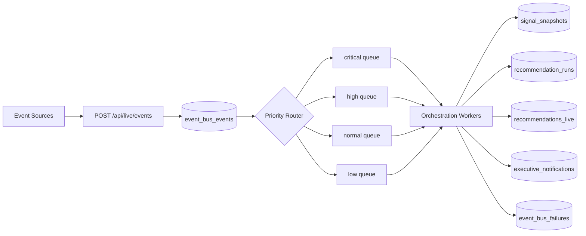
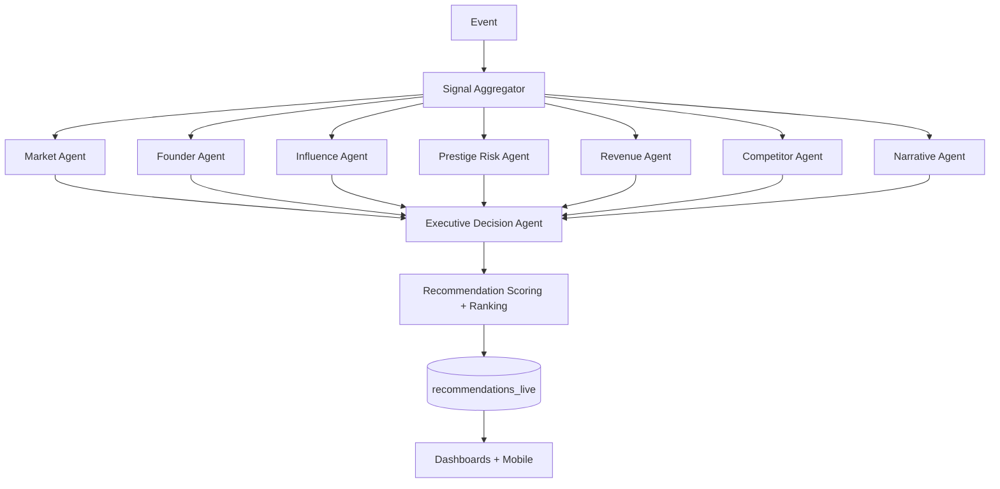
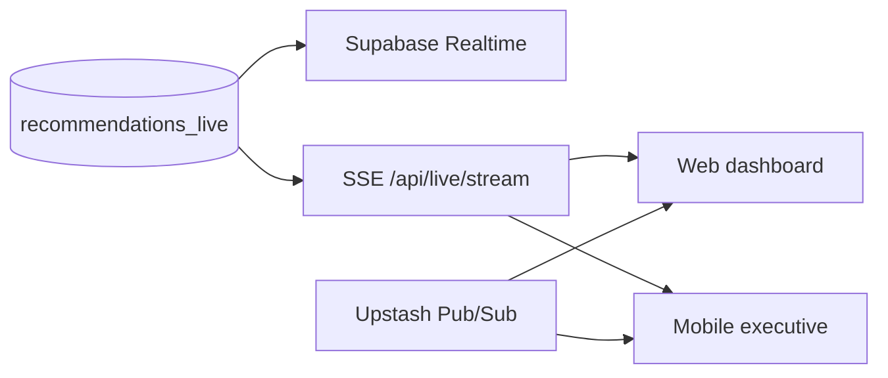

# APEX Live Infrastructure Layer

Operational intelligence backbone for institutional luxury operators.

## Objectives

- Convert APEX from simulated intelligence to live operational intelligence.
- Support multi-tenant organizations with hard isolation and executive RBAC.
- Enable event-driven orchestration for realtime recommendations.
- Persist strategic memory for outcome-aware recommendation evolution.
- Provide operational APIs and streaming channels for dashboards and mobile executive mode.

## 1) Supabase Architecture

### Multi-tenant model

- Tenant boundary: `organizations`
- Membership and roleing: `organization_memberships`
- Workspace segmentation: `organization_workspaces`
- Existing commercial entities (`clients`) can be mapped by `clients.organization_id`.

### User architecture and RBAC

- Identity source: Supabase Auth (`auth.users`) + `profiles`
- Membership role: `membership_role` (`owner`, `executive`, `strategist`, `operator`, `analyst`, `viewer`)
- Executive access level: `executive_access_level` (`observer` -> `owner`)
- Runtime authorization helpers:
  - `fn_is_org_member(org_id)`
  - `fn_exec_level(org_id)`
  - `fn_exec_at_least(org_id, level)`

### Session management and hardening

- `executive_sessions` persists session metadata, MFA state, expiry, revoke state.
- Session token material is stored as hash (`session_token_hash`).
- Revocation and anomaly controls operate via `revoked_at`, `revoke_reason`, and audit logs.

### Edge Functions strategy

Deploy Supabase Edge Functions for:

- Orchestration workers (`orchestrate-recommendations`)
- Retry/dead-letter processing (`retry-failures`)
- Push gateway (`executive-notify`)
- Memory embedding ingestion (`memory-embed`)

### Realtime channels

- Postgres Changes for durable feed sync from:
  - `event_bus_events`
  - `signal_snapshots`
  - `recommendations_live`
  - `executive_notifications`
- Broadcast channels for low-latency tactical fanout:
  - `org:{org_id}:recommendations`
  - `org:{org_id}:alerts`

### Security model and RLS

- RLS enabled on all live-infrastructure tables.
- All reads and writes require organization membership or minimum executive level.
- Write paths use minimum privilege (`operator`, `strategist`, `executive`, `owner`) per table criticality.
- Service-role operations reserved for server-side orchestration and queue workers only.

### Indexing strategy

- Hot-path indexes for organization + created/received timestamps.
- Priority/status indexes for queue scanning.
- Partial indexes for active recommendations and sessions.
- Vector index (`ivfflat`) on `executive_memories.embedding` for semantic recall.

### Scaling strategy

- Partition `event_bus_events` by time at high throughput (recommended after sustained >50M rows).
- Keep write-heavy event tables narrow and immutable.
- Move complex reads to materialized views or read models.
- Use queue fanout workers and backpressure limits per org.

## 2) Event Bus Architecture

### Pipeline

- Ingestion API: `POST /api/live/events`
- Persistent ingress: `event_bus_events`
- Priority queue routing:
  - `apex_events_critical`
  - `apex_events_high`
  - `apex_events_normal`
  - `apex_events_low`
- Failure capture: `event_bus_failures`

### Retry and failure handling

- Exponential backoff with capped delay.
- Retry scheduling in queue (`Upstash ZSET`) and persisted failure table.
- Dead-letter policy: `processing_status = dead_lettered` after max attempts.

### Realtime sync

- Upstash Redis Pub/Sub for immediate fanout.
- SSE endpoint for dashboard/mobile resilient snapshot streaming.
- Supabase Realtime as source-of-truth stream for persisted state.

### Diagram: Event routing



## 3) AI Orchestration Backend

### Multi-agent backend services

- Market Intelligence Agent
- Founder Authority Agent
- Influence Strategy Agent
- Prestige Risk Agent
- Revenue Optimization Agent
- Competitor Intelligence Agent
- Narrative Strategy Agent
- Executive Decision Agent

### Communication model

- `agent_tasks` stores stateful unit-of-work and retries.
- `agent_task_events` captures internal transitions for traceability.
- `recommendation_runs` is run-level orchestration envelope.

### Model routing logic

- `model_route` persisted per run.
- Route decision based on trigger class + risk/urgency profile.
- Confidence model versioned (`confidence_model_version`).

### Confidence recalculation

- Recompute on trigger classes:
  - event spike
  - confidence drift
  - risk threshold crossing
  - manual executive override

### Diagram: Orchestration graph



## 4) Executive Memory System

### Memory domains

- Executive interaction memory
- Strategic history memory
- Recommendation outcome memory
- Organizational intelligence memory
- Prestige trajectory memory
- Founder narrative memory
- Market event memory

### Persistence

- `executive_memories` with `memory_type`, metadata, importance, optional source recommendation.
- embeddings in `vector(1536)`.

### Pinecone strategy

- Primary choice: pgvector in Supabase for low latency and transactional consistency.
- Pinecone option for cross-region high-scale semantic workloads.
- Hybrid policy:
  - write-through to Supabase + async replicate to Pinecone
  - retrieval merge by relevance and recency

### Retrieval flow

1. Pull active recommendations and current event context.
2. Run vector similarity over memory_type subset.
3. Merge with deterministic filters (org/workspace/access level).
4. Build bounded context window for model route.

### Semantic recall policy

- Recency boost for last 7 days.
- Outcome boost for memories linked to successful executive actions.
- Penalty for stale contradictory memories.

## 5) Live Recommendation Pipeline

### Flow

- `event_bus_events` -> `signal_snapshots` -> `recommendation_runs` -> `recommendations_live` -> notifications + streams.

### Required controls

- Recommendation invalidation: `invalidated_at`, `recommendation_state`.
- Contradiction handling: `contradiction_state` lifecycle.
- Priority escalation: score thresholds with urgent fanout.
- Realtime confidence recalculation: trigger-based reruns.
- Executive routing: role-aware notification channels.

## 6) Realtime Executive System

### Live updates

- SSE endpoint: `GET /api/live/stream`
- Snapshot cadence + heartbeat frame
- Realtime feed for recommendation board and rail alerts

### Fanout

- Upstash Pub/Sub for immediate transport fanout.
- Supabase Realtime for persistence-aligned synchronization.

### Mobile strategy

- Same stream endpoint with compressed payload profile.
- High-priority alert-only mode for bandwidth-constrained clients.

### Diagram: Realtime fanout



## 7) Auth and Security

### Enterprise auth strategy

- Supabase Auth + SSO (SAML/OIDC) via enterprise providers.
- JWT validation at API boundary + org membership verification.

### Session hardening

- MFA required for executive actions.
- Session hash + revoke support.
- Device and IP telemetry in `executive_sessions`.

### Executive impersonation controls

- Disabled by default.
- If enabled, require owner-level access + explicit audit event + short TTL tokens.

### Encryption architecture

- TLS in transit.
- Sensitive fields encrypted with pgcrypto where needed.
- Service-role key server-side only.

### Threat detection

- Audit anomaly jobs (impossible travel, abnormal action burst, privilege misuse).
- Alerting into `executive_notifications` and SOC pipeline.

## 8) API Architecture

Implemented live routes:

- `POST /api/live/events`
- `GET /api/live/recommendations`
- `POST /api/live/recommendations?mode=trigger`
- `POST /api/live/recommendations?mode=manual`
- `GET /api/live/stream`
- `POST /api/live/executive-actions`

### Validation and errors

- Zod schema validation on all payloads.
- HTTP classes:
  - `400` invalid JSON or missing query parameter
  - `401` unauthorized
  - `403` org access denied
  - `422` payload contract mismatch
  - `500` internal processing failure

### Rate limiting and observability

- Recommended: Upstash fixed-window limit by org + actor + route.
- Recommended tracing tags:
  - `organization_id`
  - `workspace_id`
  - `correlation_id`
  - `event_priority`
  - `run_id`

## 9) Implementation Roadmap

### MVP backend order (week 1-2)

1. Apply live infrastructure migration.
2. Enable queue extensions and worker deployment.
3. Deploy live API routes.
4. Integrate dashboard recommendation feed to `GET /api/live/recommendations` + SSE.
5. Implement baseline orchestration worker for trigger mode.

### 30-day roadmap

- Complete agent-task workers and retry automations.
- Add confidence drift and contradiction auto-rerun logic.
- Ship executive action feedback loop into scoring model.
- Add observability dashboards (latency, queue depth, recommendation SLA).
- Add SSO enforcement for executive roles.

### 90-day roadmap

- Introduce read-model projections for high-cardinality analytics.
- Partition historical events and memory archives.
- Deploy cross-region event relay for executive mobile low-latency.
- Introduce policy simulator for RLS + access regression tests.
- Build recommendation quality evaluation framework with outcome attribution.

### Technical debt prevention

- Keep payload contracts versioned (`v1`, `v2`) and backward compatible.
- Add migration tests for RLS and policy behavior.
- Build contract tests for all live endpoints.
- Enforce schema ownership and data retention policies.

### Team hiring roadmap

- Immediate: 1 Staff Backend (event systems), 1 Platform/SRE, 1 Security Engineer.
- 30 days: 1 Data Engineer (signal pipelines), 1 Applied ML Engineer (confidence models).
- 90 days: 1 Reliability Engineer (multi-region realtime), 1 Analytics Engineer (exec read models).

## Deployment strategy

- Control plane: Supabase (Postgres, Realtime, Auth, Storage).
- Execution plane: Next.js API routes + Edge Functions + queue workers.
- Caching/queue plane: Upstash Redis for low-latency fanout and retry scheduling.
- Environments: `dev`, `staging`, `prod` with isolated projects and service keys.
- Release approach: canary by organization slug, then broad rollout.

## Folder structure (live layer)

```text
src/
  app/api/live/
    events/route.ts
    recommendations/route.ts
    stream/route.ts
    executive-actions/route.ts
  lib/live/
    contracts.ts
    authz.ts
    event-bus.ts
    recommendation-service.ts
    realtime.ts
    upstash.ts
  lib/supabase/
    admin.ts
supabase/migrations/
  20260510000002_live_infrastructure.sql
docs/infrastructure/
  APEX_LIVE_INFRASTRUCTURE_LAYER.md
  LIVE_API_CONTRACTS.md
```

## Supabase references used

- Realtime: https://supabase.com/docs/guides/realtime
- Queues: https://supabase.com/docs/guides/queues
- Queue quickstart: https://supabase.com/docs/guides/queues/quickstart
